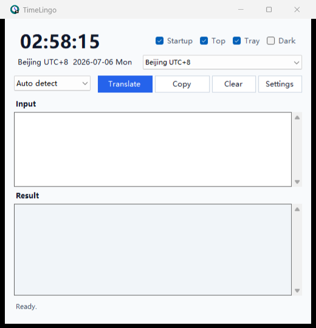

# TimeLingo

[English](README.md) | [简体中文](README.zh-CN.md)

一个很小的 Windows 悬浮工具，用来看世界时间和快速翻译。



## 功能

- 悬浮显示时间，支持常用时区预设。
- 支持常用语言之间快速翻译。
- 支持界面语言切换：英文 / 简体中文。
- 支持设置自动翻译的默认目标语言。
- 支持置顶、系统托盘、夜间模式、开机自启。
- 支持 GitHub 在线更新。

## 下载

下载一个 exe 就能用：

```text
TimeLingo.exe
```

最新版本：

```text
https://github.com/qingchencloud/time-lingo/releases/latest/download/TimeLingo.exe
```

第一次打开会出现安装引导：

- 想简单试用，点“直接试用”。
- 想长期使用，点“安装并打开”。

## 说明

默认使用公共在线翻译接口，适合日常轻量使用。公共接口慢或失败时，可以稍后重试。

长期稳定使用可以自己配置 Microsoft Translator 或 DeepL。

## License

MIT
